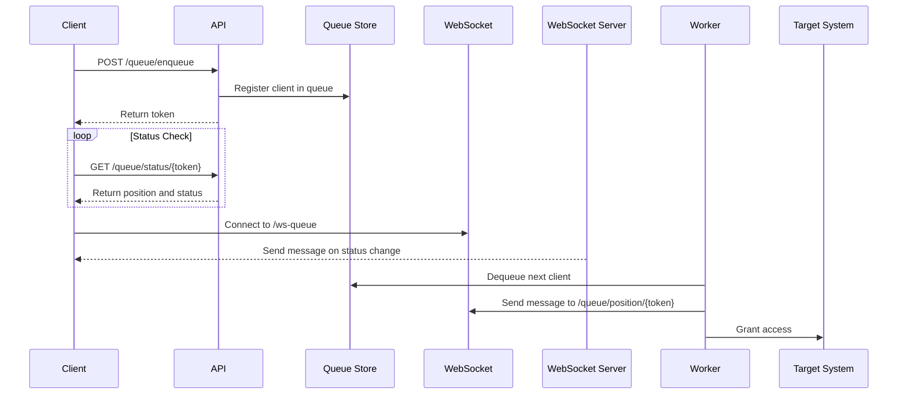

# Simple Queue

A simple and extensible queue system built with Spring Boot.
This system allows clients to register for a queue and process entries in a first-come, first-served manner.
It is designed for scenarios such as ticket reservations, limited-time sales, or high-demand access control.

## Features

* RESTful API to enqueue and dequeue clients
* FIFO (First-In-First-Out) queue logic
* Optional TTL (time-to-live) for queue entries
* Configurable capacity and rate limits
* Easily pluggable with Redis or in-memory store
* WebSocket support for real-time updates *(NEW)*
* Lightweight and production-ready

## Use Cases

* Online ticket booking systems
* Flash sales or limited product drops
* Appointment or registration systems with high traffic
* Entrance control for time-sensitive events or services

## System Overview

This system accepts queue registration requests via an HTTP API.
Clients receive a unique token and can check their queue position.
A background process or worker dequeues users and grants access based on order.
The queue can be backed by an in-memory structure or Redis for persistence and scalability.
Real-time updates are sent to clients using WebSocket channels.

## Getting Started

### Prerequisites

* Java 21
* Gradle
* (Optional) Redis server

### Installation

1. Clone the repository
2. Build the project
3. Run the Spring Boot application

### Configuration

The queue settings can be configured using standard Spring Boot configuration.
You can choose between in-memory or Redis-backed implementations and set queue limits.

## 2.1 Core API Features

* **POST /queue/enqueue**: Enqueue a client. Returns a unique token.
* **GET /queue/status/{token}**: Check the current position and status of a client in the queue.
* **POST /queue/dequeue**: Dequeue the next client for processing (used by worker or backend).
* **DELETE /queue/cancel/{token}** *(Planned)*: Cancel a client's queue entry.

## 2.2 WebSocket Features

* **Connection Endpoint**: `/ws-queue`
* **Protocol**: SockJS + STOMP
* **Subscription Topic**: `/queue/position/{token}` — receive real-time status messages
* **Notification Content**: Queue position changes, readiness alerts, TTL expiration notices, etc.

## Requirements

### Functional Requirements

* Users must be able to register into a queue via REST API.
* Users must be able to check their queue position and readiness.
* WebSocket must push real-time updates on queue status.
* Workers must be able to dequeue users for access control.

### Non-Functional Requirements

* System must follow FIFO processing.
* Redis or in-memory storage must be configurable.
* The application must be lightweight and production-ready.

## Implementation Details

### Workflow

1. Client sends a POST request to enqueue.
2. Server stores the client in the queue and returns a token.
3. Client checks their status periodically or via WebSocket.
4. Worker dequeues clients and notifies them in real-time.

### Queue Management

* **Queue Structure**: FIFO order maintained in memory or Redis
* **Token Tracking**: Unique token identifies each client
* **TTL Support**: Expired entries are automatically purged
* **Worker Logic**: Background task or endpoint dequeues clients and triggers notifications

## Contributing

We welcome contributions and ideas! Please open an issue or submit a pull request.

Steps to contribute:

1. Fork the repository
2. Create a feature branch
3. Commit your changes
4. Open a pull request

## TODO

* Redis backend implementation
* Authentication integration
